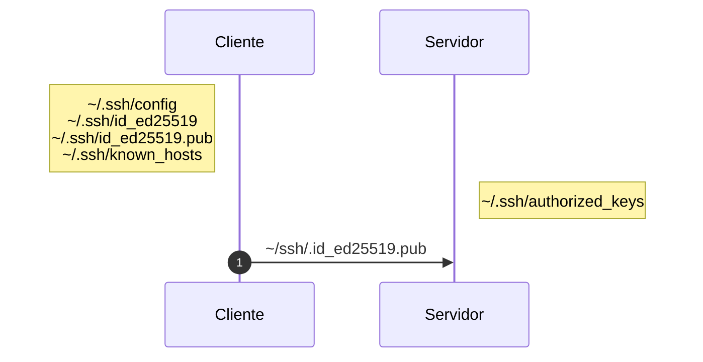
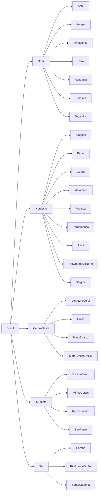

# Info3m

## Configuração básica para acesso SSH

Abra um terminal (No Windows, use o [Git Bash](https://git-scm.com/downloads/win))

1. Crie o diretório `~/.ssh`

   `ssh github.com`

1. Instale extensões do VS Code
   
   1. `code --install-extension ms-vscode-remote.remote-ssh`
   1. `code --install-extension ms-vscode-remote.remote-ssh-edit`
   

2. Abra o diretório `~/.ssh` com o VS Code

   `code ~/.ssh`

3. Crie um par de chaves privada/pública do tipo ED25519 se necessário

   `[ -f ~/.ssh/id_ed25519 ] || ssh-keygen`

4. Crie um *host* apelidado `i3m` para facilitar o acesso
   ```bash
   grep -q i3m ~/.ssh/config || cat >> ~/.ssh/config << EOF
   Host i3m
     HostName 192.168.56.73
     User estudante
   EOF
   ```

5. Copie a chave pública (`~/.ssh/id_ed25519.pub`) para servidor (`192.168.56.73`), no arquivo `~estudante/.authorized_keys` do servidor

   `ssh-copy-id i3m`

6. Estabeleça a conexão SSH
   
   `ssh i3m`

7. Verifique as chaves autorizadas

   `cat -n ~/.ssh/authorized_keys`

## Digrama de sequência
 


## Atividade

1. Crie a seguinte estrutura de diretórios, com Brasil e suas regiões.

   ```mermaid
   graph LR
     Brasil --> Norte
     Brasil --> Nordeste
     Brasil --> CentroOeste
     Brasil --> Sudeste
     Brasil --> Sul
   ```

2. Adicione os estados a seu grafo

- Gato: &#128008;
- Rato: &#128001;


