# Info3m

## Configuração básica para acesso SSH

Abra um terminal (No Windows, use o [Git Bash](https://git-scm.com/downloads/win))

1. Crie o diretório `~/.ssh`

   `ssh github.com`

1. Instale extensões do VS Code
   
   1. `code --install-extension ms-vscode-remote.remote-ssh`
   1. `code --install-extension ms-vscode-remote.remote-ssh-edit`
   

2. Abra o diretório `~/.ssh` com o VS Code

   `code ~/.ssh`

3. Crie um par de chaves privada/pública do tipo ED25519 se necessário

   `[ -f ~/.ssh/id_ed25519 ] || ssh-keygen`

4. Crie um *host* apelidado `i3m` para facilitar o acesso
   ```bash
   grep -q i3m ~/.ssh/config || cat >> ~/.ssh/config << EOF
   Host i3m
     HostName 192.168.56.73
     User estudante
   EOF
   ```

5. Copie a chave pública (`~/.ssh/id_ed25519.pub`) para servidor (`192.168.56.73`), no arquivo `~estudante/.authorized_keys` do servidor

   `ssh-copy-id i3m`

6. Estabeleça a conexão SSH
   
   `ssh i3m`

7. Verifique as chaves autorizadas

   `cat -n ~/.ssh/authorized_keys`

## Digrama de sequência
 


## Atividade

1. Crie a seguinte estrutura de diretórios, com Brasil e suas regiões.

   ```mermaid
   graph LR
     BR["🇧🇷 Brasil"] --> N["Norte"]
     BR --> NE["Nordeste"]
     BR --> CO["Centro-Oeste"]
     BR --> SE["Sudeste"]
     BR --> S["Sul"]
   ```

2. Adicione os estados a seu grafo

- Gato: &#128008;
- Rato: &#128001;

```mermaid
graph LR
  BR["🇧🇷 Brasil"] --> N["Norte"]
  BR --> NE["Nordeste"]
  BR --> CO["Centro-Oeste"]
  BR --> SE["Sudeste"]
  BR --> S["Sul"]

  N --> AC["Acre"]
  N --> AP["Amapá"]
  N --> AM["Amazonas"]
  N --> PA["Pará"]
  N --> RO["Rondônia"]
  N --> RR["Roraima"]
  N --> TO["Tocantins"]

  NE --> AL["Alagoas"]
  NE --> BA["Bahia"]
  NE --> CE["Ceará"]
  NE --> MA["Maranhão"]
  NE --> PB["Paraíba"]
  NE --> PE["Pernambuco"]
  NE --> PI["Piauí"]
  NE --> RN["Rio Grande do Norte"]
  NE --> SEr["Sergipe"]

  CO --> DF["Distrito Federal"]
  CO --> GO["Goiás"]
  CO --> MT["Mato Grosso"]
  CO --> MS["Mato Grosso do Sul"]

  SE --> ES["Espírito Santo"]
  SE --> MG["Minas Gerais"]
  SE --> RJ["Rio de Janeiro"]
  SE --> SP["São Paulo"]

  S --> PR["Paraná"]
  S --> RS["Rio Grande do Sul"]
  S --> SC["Santa Catarina"]

```


